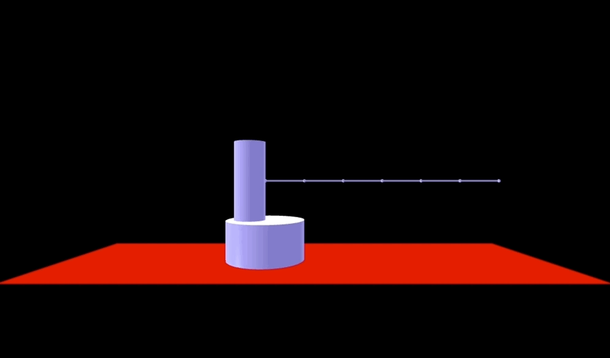

# Mobile Manipulation Path Planning

> Demo of the simulated planner in action. Notice how it avoids self intersection and collision with the floor.

## Current State
* Basic segment model of the Fetch
    * Can do inverse kinematics, track tool position
    * Added basic visualization
    * Can do collision checking with rough base approximation
    * Run `Driver.py` to see a test

## Requirements
* Run with Python 3.6
    * The only dependency is currently numpy and vpython

## Todo
* Have some way to move 3D camera around easily
* Update internal fetch model to have real joint lengths
    * Also real base heights / positions
* Get the 'mobile' part working
    * Add some sort of a base to the fetch object
* Add Bi2RRT*
* Try to improve RRT
    * Right now we only consider distance between closest nodes
    * Should probably also factor in the node's distance to the start/goal
        * Maybe this is what RRT* is lol idk
